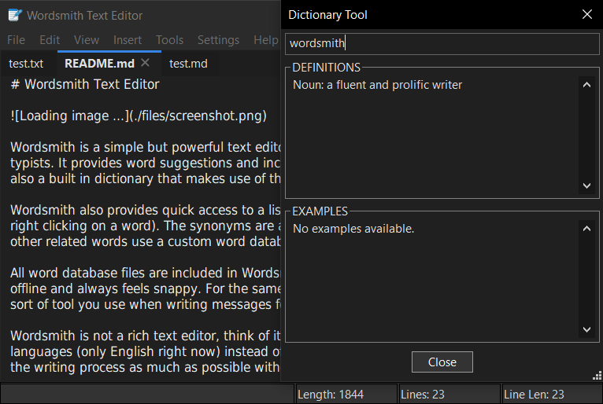

# Wordsmith Text Editor

Wordsmith is a simple but powerful text editor designed specifically for writers and speed typists. It provides word suggestions and includes an auto-complete feature. There is also a built in dictionary that makes use of the [Open English Wordnet](https://github.com/globalwordnet/english-wordnet).

Wordsmith also provides quick access to a list of synonyms and other related words (by right clicking on a word). The synonyms are also taken from the Open English Wordnet, the other related words use a custom word database created using [WordParser](https://github.com/JacobBruce/WordParser).

All word database files are included in [Wordsmith releases](https://github.com/JacobBruce/Wordsmith/releases) so the app can run completely offline and always feels snappy. For the same reason, Wordsmith doesn't use any AI, it's the sort of tool you use when writing messages for an AI.

Wordsmith is not a rich text editor, think of it more like a code editor but for human languages (only English right now) instead of programming languages. It aims to enhance the writing process as much as possible without relying on LLM's.

Wordsmith also includes a built in document viewer which supports HTML and Markdown files, making it easy to preview your documents. It also provides Markdown formatting tools so you wont need to remember most of the Markdown syntax.

Wordsmith also includes a built in spell-checker and the ability to add/remove words from the dictionary. Along with the word manager, it also includes a "phrase manager", providing quick access to phrases or sentences that are used frequently.

## Libraries Used

- [wxWidgets](https://github.com/wxWidgets/wxWidgets)
- [MD4C](http://github.com/mity/md4c)
- [yams-symspell](https://github.com/trvon/yams-symspell)
- [parallel-hashmap](https://github.com/greg7mdp/parallel-hashmap)
- [Chocobo1-Hash](https://github.com/Chocobo1/Hash)